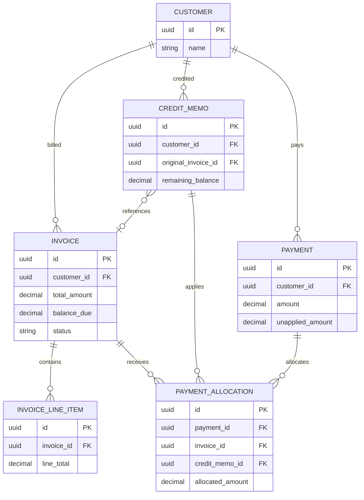
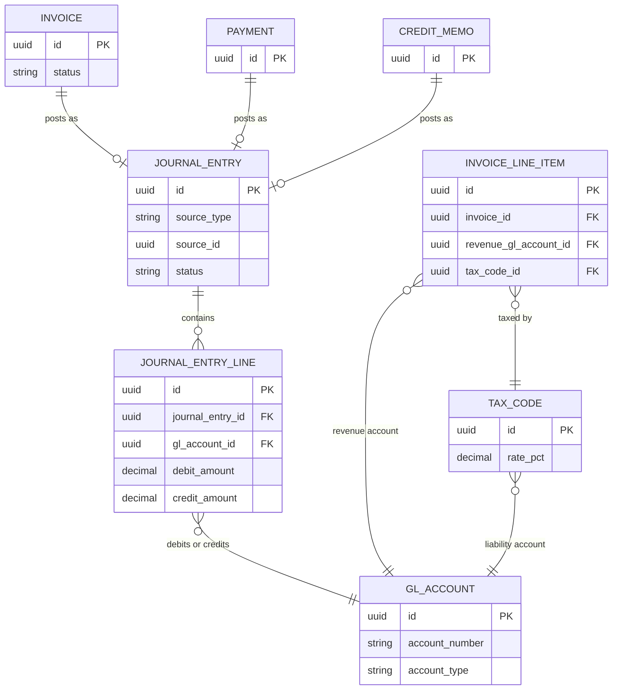
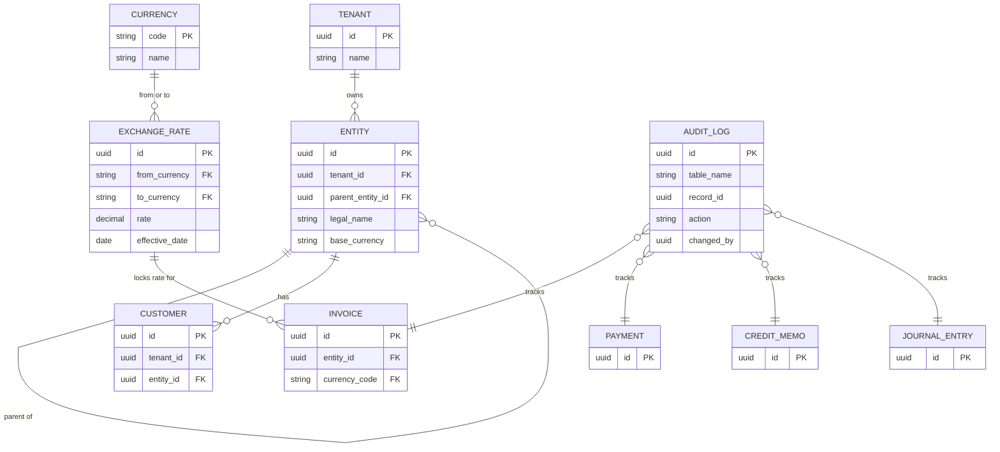

# Invoicing & Accounts Receivable Module — Design Document

Prototype design for the invoicing and AR module of a multi-tenant ERP platform, covering data modeling, multi-entity/multi-currency support, GL integration, audit trails, and API design.

## Table of Contents
1. [Entity Relationship Model](#entity-relationship-model)
2. [Simplified ERD (readable diagrams)](#simplified-erd-readable-diagrams)
3. [Multi-Tenant & Multi-Entity Design](#multi-tenant--multi-entity-design)
4. [Accounting Integration](#accounting-integration--data-model--architecture-design)
5. [State Management](#state-management--invoice-lifecycle)
6. [API Design](#api-design--invoicing--accounts-receivable)

---

## Entity Relationship Model


### Design Decisions (read before the tables)

| Concern | Decision |
|---|---|
| Multi-tenancy | Shared schema, row-level isolation via `tenant_id` on every table (enforced with Postgres Row-Level Security). Chosen for operational simplicity at mid-market scale vs. schema/DB-per-tenant, which don't scale operationally past a few hundred tenants. |
| Multi-entity | A `tenant` owns many `entity` rows (legal entities/subsidiaries). `entity` self-references `parent_entity_id` for corporate hierarchies. Every transactional row carries both `tenant_id` (isolation) and `entity_id` (which books it hits) so consolidated *and* entity-level reporting both work off the same tables. |
| Multi-currency | Every money-bearing document stores its own `currency_code` plus a locked `exchange_rate_id` snapshot at transaction time (never a live rate lookup). Journal entry lines store both transaction-currency and entity-base-currency amounts, so FX gain/loss is derivable and GL always reconciles in base currency. |
| GL integration | Invoices, payments, and credit memos never touch GL balances directly. Posting one creates a `journal_entry` (header) + `journal_entry_line` (balanced debit/credit rows) via double-entry. The subledger document stores `gl_journal_entry_id` back-reference for one-click drill-down both directions. |
| Audit trail | Immutable `audit_log` capturing field-level before/after on every write to financial tables, plus soft state fields (`created_by`, `posted_by`, `posted_at`, `voided_by`, `voided_at`) on the documents themselves so "who posted/voided this" doesn't require replaying the log. Journal entries are never edited once posted — only reversed with a new linked JE (`reversal_of_je_id`), preserving history. |
| Partial payments / allocation | `payment` is a single cash receipt that can fund many invoices; `payment_allocation` is the many-to-many join (payment ↔ invoice *or* payment ↔ credit memo) carrying the allocated amount. This supports partial payment, overpayment (unapplied balance sits on the payment), and one payment covering many invoices. |
| Credit memos | Modeled as their own document (not a negative invoice) with optional `original_invoice_id` link, its own lines, and its own balance — because credit memos can be issued independent of a specific invoice (e.g., goodwill credit) and are consumed the same way cash is, via `payment_allocation`. |
| Aging & revenue recognition | Aging is a **derived view** off `invoice.balance_due` and `due_date` (no stored bucket table — buckets are query-time `CASE` logic, otherwise the snapshot goes stale). Revenue recognition fields live at the `invoice_line_item` grain (`recognition_method`, start/end dates, `deferred_revenue_gl_account_id`) since a single invoice commonly mixes immediately-recognized and deferred lines (e.g., a hardware line vs. a 12-month support line). |

---

### Entities

#### `tenant`
| Column | Type | Notes |
|---|---|---|
| id | uuid PK | |
| name | text | |
| subdomain | text unique | |
| status | enum(active, suspended, closed) | |
| default_base_currency | char(3) | fallback for new entities |
| created_at | timestamptz | |

#### `entity`  (legal entity / subsidiary)
| Column | Type | Notes |
|---|---|---|
| id | uuid PK | |
| tenant_id | uuid FK → tenant | |
| parent_entity_id | uuid FK → entity, nullable | self-ref for corporate hierarchy |
| legal_name | text | |
| display_name | text | |
| base_currency | char(3) FK → currency | currency GL balances are kept in |
| country_code | char(2) | |
| tax_registration_id | text | e.g. VAT/EIN |
| is_active | boolean | |
| created_at | timestamptz | |

#### `customer`
| Column | Type | Notes |
|---|---|---|
| id | uuid PK | |
| tenant_id | uuid FK → tenant | |
| entity_id | uuid FK → entity | "home" billing entity |
| customer_number | text | unique per tenant |
| name | text | |
| billing_address | jsonb | |
| shipping_address | jsonb | |
| invoice_currency | char(3) FK → currency | customer's preferred billing currency |
| payment_terms_days | int | e.g. Net 30 |
| credit_limit | numeric(18,2) | |
| tax_exempt | boolean | |
| status | enum(active, on_hold, inactive) | |
| created_at / updated_at | timestamptz | |

#### `currency`
| Column | Type | Notes |
|---|---|---|
| code | char(3) PK | ISO 4217, e.g. USD |
| name | text | |
| decimal_places | smallint | 2 for USD, 0 for JPY, etc. |

#### `exchange_rate`
| Column | Type | Notes |
|---|---|---|
| id | uuid PK | |
| tenant_id | uuid FK → tenant | |
| from_currency | char(3) FK → currency | |
| to_currency | char(3) FK → currency | |
| rate | numeric(18,8) | |
| effective_date | date | |
| source | text | e.g. "ECB", "manual" |
| created_at | timestamptz | rates are append-only, never mutated |

#### `invoice`
| Column | Type | Notes |
|---|---|---|
| id | uuid PK | |
| tenant_id | uuid FK → tenant | |
| entity_id | uuid FK → entity | |
| customer_id | uuid FK → customer | |
| invoice_number | text | unique per entity |
| invoice_date | date | |
| due_date | date | |
| currency_code | char(3) FK → currency | transaction currency |
| exchange_rate_id | uuid FK → exchange_rate | locked rate to entity base currency |
| subtotal | numeric(18,2) | |
| tax_amount | numeric(18,2) | |
| total_amount | numeric(18,2) | |
| amount_paid | numeric(18,2) | denormalized running total, updated by allocation |
| balance_due | numeric(18,2) | generated: total_amount − amount_paid |
| status | enum(draft, sent, partial, paid, overdue, void) | |
| po_number | text nullable | |
| gl_journal_entry_id | uuid FK → journal_entry, nullable | set on posting |
| created_by / posted_by / voided_by | uuid FK → user | |
| created_at / posted_at / voided_at | timestamptz | |

#### `invoice_line_item`
| Column | Type | Notes |
|---|---|---|
| id | uuid PK | |
| invoice_id | uuid FK → invoice | |
| line_number | int | |
| description | text | |
| quantity | numeric(18,4) | |
| unit_price | numeric(18,4) | |
| discount_pct | numeric(5,2) | |
| tax_code_id | uuid FK → tax_code | |
| line_subtotal / line_tax / line_total | numeric(18,2) | |
| revenue_gl_account_id | uuid FK → gl_account | |
| recognition_method | enum(immediate, straight_line, milestone) | |
| recognition_start_date / recognition_end_date | date, nullable | for deferred revenue lines |
| deferred_revenue_gl_account_id | uuid FK → gl_account, nullable | |

#### `tax_code`
| Column | Type | Notes |
|---|---|---|
| id | uuid PK | |
| tenant_id | uuid FK → tenant | |
| name | text | |
| rate_pct | numeric(5,2) | |
| liability_gl_account_id | uuid FK → gl_account | |

#### `credit_memo`
| Column | Type | Notes |
|---|---|---|
| id | uuid PK | |
| tenant_id | uuid FK → tenant | |
| entity_id | uuid FK → entity | |
| customer_id | uuid FK → customer | |
| credit_memo_number | text | |
| credit_memo_date | date | |
| reason_code | enum(returns, pricing_error, goodwill, write_off, other) | |
| original_invoice_id | uuid FK → invoice, nullable | optional link |
| currency_code | char(3) FK → currency | |
| exchange_rate_id | uuid FK → exchange_rate | |
| subtotal / tax_amount / total_amount | numeric(18,2) | |
| remaining_balance | numeric(18,2) | decremented as applied via payment_allocation |
| status | enum(draft, issued, partially_applied, fully_applied, void) | |
| gl_journal_entry_id | uuid FK → journal_entry | |
| created_by / created_at | | |

#### `credit_memo_line_item`
Same shape as `invoice_line_item` (description, qty, unit_price, tax_code_id, gl_account_id, line_total) — omitted here for brevity, identical pattern.

#### `payment`
| Column | Type | Notes |
|---|---|---|
| id | uuid PK | |
| tenant_id | uuid FK → tenant | |
| entity_id | uuid FK → entity | |
| customer_id | uuid FK → customer | |
| payment_number | text | |
| payment_date | date | |
| payment_method | enum(ach, wire, check, card, other) | |
| currency_code | char(3) FK → currency | |
| exchange_rate_id | uuid FK → exchange_rate | |
| amount | numeric(18,2) | total cash received |
| unapplied_amount | numeric(18,2) | amount not yet allocated (overpayment / on-account cash) |
| reference_number | text | check #, wire ref |
| status | enum(pending, cleared, bounced) | |
| gl_journal_entry_id | uuid FK → journal_entry | |
| created_by / created_at | | |

#### `payment_allocation`
| Column | Type | Notes |
|---|---|---|
| id | uuid PK | |
| tenant_id | uuid FK → tenant | |
| payment_id | uuid FK → payment | |
| invoice_id | uuid FK → invoice, nullable | exactly one of invoice_id / credit_memo_id is set |
| credit_memo_id | uuid FK → credit_memo, nullable | lets a credit memo fund an invoice too |
| allocated_amount | numeric(18,2) | |
| allocation_date | date | |
| created_by | uuid FK → user | |

*(Check constraint: exactly one of `invoice_id`/`credit_memo_id` non-null — this is the join table that makes partial payments, overpayment, and credit-memo-against-invoice all fall out of one mechanism.)*

#### `gl_account` (chart of accounts)
| Column | Type | Notes |
|---|---|---|
| id | uuid PK | |
| tenant_id | uuid FK → tenant | |
| entity_id | uuid FK → entity, nullable | null = shared COA across entities |
| account_number | text | |
| account_name | text | |
| account_type | enum(asset, liability, equity, revenue, expense) | |
| normal_balance | enum(debit, credit) | |
| parent_account_id | uuid FK → gl_account, nullable | rollup hierarchy |
| is_active | boolean | |

#### `journal_entry`
| Column | Type | Notes |
|---|---|---|
| id | uuid PK | |
| tenant_id | uuid FK → tenant | |
| entity_id | uuid FK → entity | |
| je_number | text | |
| je_date | date | |
| source_type | enum(invoice, payment, credit_memo, manual) | |
| source_id | uuid | polymorphic pointer back to the originating document |
| description | text | |
| status | enum(draft, posted, reversed) | posted JEs are immutable |
| reversal_of_je_id | uuid FK → journal_entry, nullable | |
| posted_by / posted_at | | |
| created_at | | |

#### `journal_entry_line`
| Column | Type | Notes |
|---|---|---|
| id | uuid PK | |
| journal_entry_id | uuid FK → journal_entry | |
| line_number | int | |
| gl_account_id | uuid FK → gl_account | |
| debit_amount / credit_amount | numeric(18,2) | one is zero; sum(debits)=sum(credits) per JE |
| currency_code | char(3) FK → currency | transaction currency |
| base_currency_amount | numeric(18,2) | converted to entity base currency |
| exchange_rate_used | numeric(18,8) | |
| customer_id | uuid FK → customer, nullable | reporting dimension |
| memo | text | |

#### `audit_log`
| Column | Type | Notes |
|---|---|---|
| id | uuid PK | |
| tenant_id | uuid FK → tenant | |
| table_name | text | |
| record_id | uuid | |
| action | enum(insert, update, delete, post, void, reverse) | |
| field_name | text, nullable | null for row-level actions like post/void |
| old_value / new_value | jsonb | |
| changed_by | uuid FK → user | |
| changed_at | timestamptz | |
| ip_address | inet | |

---

### Relationship Summary

- `tenant` 1—* `entity` (self-referencing hierarchy for subsidiaries)
- `entity` 1—* `customer`, `invoice`, `payment`, `credit_memo`, `gl_account`, `journal_entry`
- `customer` 1—* `invoice`, `payment`, `credit_memo`
- `invoice` 1—* `invoice_line_item`; `invoice` 1—1 `journal_entry` (on posting); `invoice` 1—* `payment_allocation`
- `credit_memo` 1—* `credit_memo_line_item`; `credit_memo` 1—1 `journal_entry`; `credit_memo` 1—* `payment_allocation`
- `payment` 1—* `payment_allocation` (one payment funds many invoices/credit memos — the core partial-payment mechanism)
- `journal_entry` 1—* `journal_entry_line` (must balance: Σdebits = Σcredits)
- `gl_account` referenced by `invoice_line_item`, `tax_code`, `journal_entry_line` (what gets debited/credited)
- `exchange_rate` referenced by `invoice`, `payment`, `credit_memo`, `journal_entry_line` (rate locked at transaction time, never recomputed retroactively)
- `audit_log` polymorphically references every financial table by `table_name` + `record_id`

### Derived / Reporting Views (not stored tables)
- **AR Aging**: `SELECT customer_id, balance_due, CASE WHEN due_date >= today THEN 'current' WHEN today-due_date <= 30 THEN '1-30' ... END FROM invoice WHERE balance_due > 0` — computed at query time so it's always accurate as of "now," never a stale snapshot.
- **Deferred Revenue Schedule**: derived from `invoice_line_item` rows where `recognition_method != immediate`, spread across `recognition_start_date`→`recognition_end_date`.
-e 
---

## Simplified ERD (readable diagrams)

_The full model above is dense. The diagrams below split it into three focused views: core AR flow, GL posting, and supporting infrastructure._


The full 16-entity model is split into three focused diagrams below, since a
single diagram with every cross-link becomes hard to trace. Each one is a
slice of the same overall schema.

### 1. Core AR flow
Customer → invoice → payment/credit memo, and how partial payments and
allocation work.



### 2. GL posting layer
How invoices, payments, and credit memos become balanced journal entries.



### 3. Supporting infrastructure
Tenant/entity isolation, currency locking, and audit tracking.


-e 
---

## Multi-Tenant & Multi-Entity Design

### The two problems are different, and conflating them is the most common mistake

- **Tenant isolation** is a *security* boundary — Tenant A must never see Tenant B's data, full stop, even under application bugs.
- **Multi-entity structure** is a *business* boundary — within one tenant, Subsidiary A and Subsidiary B are legally separate books, but the parent company legitimately needs to see across them (consolidated reporting, intercompany transactions).

So the isolation mechanism has to be strict and defensive at the tenant layer, and flexible/permeable at the entity layer. One `tenant_id` + `entity_id` pair on every row, enforced by two different mechanisms, is the design.

### Layer 1 — Tenant isolation (hard boundary)

**Model**: shared schema, shared tables, `tenant_id` on every row. Chosen over schema-per-tenant or database-per-tenant because at mid-market scale (hundreds to low thousands of tenant companies), per-tenant schemas turn every migration into a fan-out across N schemas, and per-tenant databases multiply connection pools and ops burden for no security benefit a shared schema with proper enforcement can't also provide.

**Enforcement is defense-in-depth, not a single check:**

1. **Database-level — Postgres Row-Level Security (RLS).** Every tenant-scoped table gets a policy like:
   ```sql
   ALTER TABLE invoice ENABLE ROW LEVEL SECURITY;
   CREATE POLICY tenant_isolation ON invoice
     USING (tenant_id = current_setting('app.current_tenant')::uuid);
   ```
   The app sets `app.current_tenant` once per request/connection (`SET app.current_tenant = '...'`). This means even a raw, unfiltered `SELECT * FROM invoice` from application code physically cannot return another tenant's rows — the database refuses at the storage layer, not the query layer. A forgotten `WHERE tenant_id = ?` in some code path is a bug, not a breach.
2. **Application-level — a tenant-scoped repository/ORM layer.** All data access goes through a base repository that injects `tenant_id` automatically; engineers don't hand-write tenant filters per query. RLS is the safety net for when this layer is bypassed or has a bug — not the only line of defense.
3. **Connection-level — tenant context set once at request entry**, derived from the authenticated session/JWT, never from a client-supplied parameter (a `tenant_id` in a request body or query string is untrusted input and is never used to select which tenant's data to return).
4. **No cross-tenant foreign keys, ever.** Every FK in the schema points to a row that shares the same `tenant_id` — a `customer_id` on an invoice can only ever resolve to a customer under that same tenant. This is enforced with composite foreign keys `(tenant_id, customer_id)` rather than bare `customer_id`, so the database itself rejects an attempt to attach one tenant's invoice to another tenant's customer.

### Layer 2 — Multi-entity structure (permeable, business-governed boundary)

Within a tenant, the `entity` table models the corporate structure:

```sql
CREATE TABLE entity (
  id uuid PRIMARY KEY,
  tenant_id uuid NOT NULL REFERENCES tenant(id),
  parent_entity_id uuid REFERENCES entity(id),  -- self-referencing hierarchy
  legal_name text NOT NULL,
  base_currency char(3) NOT NULL,
  ...
);
```

Every transactional table (`invoice`, `payment`, `credit_memo`, `journal_entry`, `gl_account`) carries **both** `tenant_id` and `entity_id`. This lets one query answer either question:

- *"Show me Subsidiary B's AR aging"* → filter on `entity_id = B`
- *"Show me the parent's consolidated AR aging"* → filter on `tenant_id = T`, group/roll up by walking the `parent_entity_id` tree

**Access to entities is a permission concern, not a data-partitioning concern.** A controller at the parent company should be able to see all subsidiaries; a subsidiary bookkeeper should only see their own entity. This is modeled as a `user_entity_access` join table (`user_id`, `entity_id`, `role`) checked in the application layer — deliberately *not* enforced via RLS the same way tenant isolation is, because the access pattern is legitimately hierarchical and changes based on role, unlike tenant boundaries which are never supposed to be crossed by anyone.

```sql
CREATE TABLE user_entity_access (
  user_id uuid NOT NULL,
  entity_id uuid NOT NULL,
  tenant_id uuid NOT NULL,  -- redundant but enforced, belt-and-suspenders against cross-tenant grants
  role text NOT NULL,       -- e.g. 'entity_viewer', 'entity_admin', 'parent_consolidator'
  PRIMARY KEY (user_id, entity_id)
);
```

### Intercompany transactions

Subsidiaries bill each other (e.g. shared services charged from parent to subsidiary). This is modeled as an ordinary `invoice`/`payment` pair where the "customer" side is itself represented by a `customer` row flagged `is_intercompany = true` and linked to the counterpart `entity_id`. This keeps the GL correct on both sides (Subsidiary A books revenue, Subsidiary B books an expense/AP) without inventing a parallel schema for intercompany-specific transactions — and it naturally nets out or eliminates in consolidated reporting by filtering `is_intercompany` rows during rollup.

### Chart of accounts: shared vs. per-entity

`gl_account.entity_id` is nullable by design:

- **Null** → a shared, tenant-wide chart of accounts that every entity maps into (typical for a tightly controlled corporate structure that wants comparable P&Ls across subsidiaries).
- **Set** → an entity-specific chart of accounts (typical when a subsidiary was acquired and kept its own accounting structure). Consolidated reporting then requires an account-mapping table (`entity_account_id → consolidated_account_id`) rather than a direct rollup.

This is a decision each tenant makes at entity-creation time, not a schema-wide constraint.

### What this buys, and the tradeoff being made explicitly

- **Buys**: one codebase, one set of migrations, straightforward cross-entity consolidated reporting (it's a `GROUP BY` up a tree, not a distributed query across N databases), and a security boundary enforced by the database engine itself rather than application diligence alone.
- **Costs / risks accepted**: a single noisy-neighbor tenant can affect shared infrastructure performance (mitigated with per-tenant rate limiting and query timeouts, not schema separation); a bug in RLS policy configuration is a serious incident (mitigated by making RLS policy tests part of CI — every new tenant-scoped table must have a corresponding isolation test before merge, not by trusting code review alone).
-e 
---

## Accounting Integration — Data Model & Architecture Design

### Design principle

The subledger (invoice, payment, credit_memo) never mutates GL balances directly. Every posting event creates a **journal entry** — a header plus a set of balanced debit/credit lines — through one shared `postJournalEntry()` service. This is non-negotiable in accounting software: if invoices and payments each rolled their own GL-writing logic, the two paths would drift out of balance over time. One posting engine, many callers.

```
Invoice.post() ──┐
Payment.post() ──┼──▶ JournalEntryService.post(lines[]) ──▶ journal_entry + journal_entry_line (atomic, balanced)
CreditMemo.post()┘
```

Every `journal_entry_line` set from one call must satisfy `SUM(debit_amount) = SUM(credit_amount)` — enforced in the service layer *and* with a database trigger/check, so an unbalanced entry can never be committed even if a bug slips past application code.

---

### 1. How invoices generate GL journal entries

**Trigger**: invoice transitions from `draft` → `posted` (not on creation — a draft invoice has no accounting impact, matching how real AR clerks work).

**Standard entry** for an invoice of $1,000 subtotal + $80 tax = $1,080 total:

| Account | Debit | Credit |
|---|---|---|
| Accounts Receivable (asset) | 1,080 | |
| Revenue (per line item's `revenue_gl_account_id`) | | 1,000 |
| Sales Tax Payable (`tax_code.liability_gl_account_id`) | | 80 |

```sql
-- pseudocode inside InvoiceService.post(invoice_id)
BEGIN;
  lines = [
    { account: AR_ACCOUNT,          debit: invoice.total_amount },
    -- one revenue line per distinct revenue_gl_account_id on the invoice's line items
    { account: line.revenue_gl_account_id, credit: SUM(line.line_subtotal) },
    -- one tax line per distinct tax_code, if tax_amount > 0
    { account: tax_code.liability_gl_account_id, credit: SUM(line.line_tax) }
  ];
  je_id = JournalEntryService.post(
    entity_id: invoice.entity_id,
    source_type: 'invoice',
    source_id: invoice.id,
    lines: lines
  );
  UPDATE invoice SET status = 'posted', gl_journal_entry_id = je_id, posted_at = now(), posted_by = current_user;
COMMIT;
```

**Deferred revenue variant**: if a line item's `recognition_method != 'immediate'` (e.g. a 12-month support contract), that line's credit goes to a **Deferred Revenue** liability account instead of Revenue at invoice time. A separate scheduled job posts small recognition journal entries (debit Deferred Revenue, credit Revenue) across the recognition window — this keeps invoice posting and revenue recognition as two independently-triggered processes, which is what lets a single invoice mix immediate and deferred lines correctly.

**Multi-currency**: `debit_amount`/`credit_amount` on the journal line are stored in the invoice's transaction currency; `base_currency_amount` is calculated using the invoice's locked `exchange_rate_id` at posting time — never a live rate — so the GL always reconciles to a fixed number even if rates move later.

---

### 2. How payments are recorded and allocated

**Two-step process, deliberately separated:**

1. **Record the payment** — a `payment` row is created for the cash received (e.g., a $600 wire). This alone does *not* say which invoice it pays. At this point `unapplied_amount = amount = 600`.
2. **Allocate the payment** — one or more `payment_allocation` rows link the payment to specific invoices (or credit memos), each with an `allocated_amount`. Allocation can happen automatically (oldest-invoice-first, or matched by remittance reference) or manually by an AR clerk.

This separation is what makes partial payments, overpayments, and "on-account" cash (payment received before an invoice is even matched) all fall out of one mechanism instead of three special cases.

**GL entry on payment receipt** (cash received, not yet necessarily allocated):

| Account | Debit | Credit |
|---|---|---|
| Cash / Bank | 600 | |
| Accounts Receivable | | 600 |

The AR credit happens regardless of allocation status, because from a GL perspective "customer owes less" is true the moment cash clears — allocation only determines *which* invoice's sub-ledger balance drops. The subledger (`invoice.balance_due`) is updated per-allocation; the GL entry is created once per payment.

```sql
-- PaymentService.allocate(payment_id, [{invoice_id, amount}, ...])
BEGIN;
  FOR each allocation IN allocations:
    INSERT INTO payment_allocation (payment_id, invoice_id, allocated_amount, allocation_date, created_by);
    UPDATE invoice
      SET amount_paid = amount_paid + allocation.amount,
          balance_due = total_amount - amount_paid,
          status = CASE WHEN balance_due = 0 THEN 'paid'
                         WHEN balance_due < total_amount THEN 'partial'
                         ELSE status END
      WHERE id = allocation.invoice_id;
  UPDATE payment SET unapplied_amount = amount - SUM(allocations.amount);
COMMIT;
```

`balance_due` and `amount_paid` are kept as denormalized running totals (recalculable from `payment_allocation` at any time for reconciliation) so that aging reports and dashboards don't need to aggregate allocations on every read.

---

### 3. Partial payments and overpayments

**Partial payment** — a $600 payment against a $1,080 invoice: one `payment_allocation` row for $600, invoice `status` moves to `partial`, `balance_due` becomes $480. No special-cased entity; it's just an allocation smaller than the invoice balance. The invoice stays open and continues aging on the remaining $480.

**Overpayment** — a $1,200 payment against a $1,080 invoice: the allocation is capped at $1,080 (can't allocate more than an invoice's balance — enforced with a check constraint / application validation), and the remaining $120 stays as `payment.unapplied_amount`. That $120 sits on the customer's account as a credit balance until:
- it's allocated to a *future* invoice via a new `payment_allocation` row once one exists, or
- it's refunded (a separate `refund` transaction — cash out, reducing `unapplied_amount` — which is out of scope for this module but hooks into the same `payment` table), or
- it's converted to an on-account credit memo if the business wants it visible in AR reporting as a distinct instrument.

Overpayment does **not** trigger a separate GL entry at the moment of overpayment — the original payment-receipt entry already debited cash for the full $1,200 and credited AR for $1,200 (a $120 credit balance on a customer's AR is normal and shows as a negative balance in aging, which is the correct accounting treatment, not an error state).

---

### 4. Credit memo application and write-off procedures

**Issuing a credit memo** — its own document, own GL entry, independent of how it's later used:

| Account | Debit | Credit |
|---|---|---|
| Revenue (or Sales Returns & Allowances) | 200 | |
| Accounts Receivable | | 200 |

This reduces AR at issuance regardless of which invoice it eventually offsets — the customer's total AR exposure drops immediately, which is correct: the business no longer expects to collect that $200.

**Applying a credit memo to an invoice** — uses the *same* `payment_allocation` mechanism as cash payments. The allocation row's `credit_memo_id` is set (with `payment_id` left null) instead of the reverse, but the shape is identical: a funding source, an `invoice_id`, and an `allocated_amount`. No new GL entry is created on application — the credit memo's GL impact already happened at issuance; applying it is purely a subledger operation that reduces `invoice.balance_due` and `credit_memo.remaining_balance` together, the same as a payment allocation would.

```sql
-- CreditMemoService.apply(credit_memo_id, invoice_id, amount)
BEGIN;
  INSERT INTO payment_allocation (credit_memo_id, invoice_id, allocated_amount, allocation_date, created_by);
  UPDATE invoice SET amount_paid = amount_paid + amount, balance_due = total_amount - amount_paid ...;
  UPDATE credit_memo SET remaining_balance = remaining_balance - amount,
    status = CASE WHEN remaining_balance = 0 THEN 'fully_applied' ELSE 'partially_applied' END;
COMMIT;
```

**Write-off** (bad debt) — a distinct procedure from a credit memo, because the accounting intent is different: a credit memo says "we no longer expect payment because of a business reason (return, pricing error, goodwill)"; a write-off says "we no longer expect payment because the customer won't/can't pay." Modeled as a system-generated credit memo with `reason_code = 'write_off'`, applied to the specific invoice, but posting to a **Bad Debt Expense** account instead of Revenue:

| Account | Debit | Credit |
|---|---|---|
| Bad Debt Expense | 480 | |
| Accounts Receivable | | 480 |

Write-offs require an approval step before posting (typically a role check — `entity_admin` or above — since it's an unrecoverable GL entry with tax and financial-statement implications), captured in `audit_log` with the approving user, and are typically restricted to invoices past a policy-defined aging threshold (e.g., 180+ days) rather than being freely available on any open invoice.

---

### Consistency guarantees across all four flows

- **Atomicity**: every posting operation (invoice post, payment allocation, credit memo apply/write-off) is a single DB transaction — subledger state and GL journal entry are created together or not at all.
- **Immutability after posting**: once `journal_entry.status = 'posted'`, no field on it or its lines is ever updated. Corrections happen via a new reversing entry (`reversal_of_je_id`), never an in-place edit — this is what makes the audit trail and financial statements trustworthy under audit.
- **Idempotency**: posting endpoints are keyed so a retried request (e.g., a flaky network call re-submitting "allocate this payment") can't double-post — checked via a unique constraint on `(source_type, source_id)` for journal entries, and an idempotency key on allocation requests.
-e 
---

## State Management — Invoice Lifecycle

### States

| State | Meaning | Stored on `invoice.status`? |
|---|---|---|
| `draft` | Being built; not yet a financial commitment. No GL impact. | Yes |
| `approved` | Internally reviewed and locked for issuance. This is the moment it becomes a real accounting event — GL entry is posted here (debit AR, credit revenue). | Yes |
| `sent` | Customer has been notified (email/portal). Same GL state as approved; this is a customer-communication flag, not an accounting state. | Yes |
| `partially_paid` | One or more payments/credit memos allocated, `0 < balance_due < total_amount`. | Yes |
| `paid` | `balance_due = 0` via allocation. | Yes |
| `void` | Cancelled before being economically realized. Reverses the GL entry if one existed. | Yes |
| `written_off` | Balance permanently abandoned as uncollectible. Posts a Bad Debt entry. | Yes |

**"Overdue" is deliberately not a stored state.** It's derived at query time from `due_date < today AND balance_due > 0`, layered on top of whichever stored state applies (`sent` or `partially_paid`). Storing it as a state would require a scheduled job to flip every invoice at midnight and would immediately go stale the moment `now()` ticks forward — the same reasoning as the aging-report design. Aging buckets, dashboards, and reminder emails all read this as a computed flag, never as `invoice.status`.

### State diagram — happy path

Draft moves forward through approval, customer notification, and payment. Each arrow is a one-way, forward-only transition — nothing here reverts an invoice back to Draft.

The exception paths (Void, Written Off) branch off this main line and are shown separately below, since drawing every possible branch in one diagram makes it unreadable.

### Transition table

| From | To | Trigger | Guard / business rule | Who |
|---|---|---|---|---|
| — | `draft` | Invoice created | None | AR clerk |
| `draft` | `approved` | Approve action | Must have ≥1 line item; all line items must have a valid `revenue_gl_account_id`; customer must not be `on_hold` (or an explicit override + reason is logged) | AR clerk / approver role, per tenant's approval-threshold config |
| `draft` | `void` | Cancel action | None — draft has no GL impact, so cancellation is a pure delete-equivalent (soft-deleted, not hard-deleted, for audit visibility) | AR clerk |
| `approved` | `sent` | Send action (manual or automatic on approval) | None | AR clerk / system |
| `approved` | `void` | Void action | Requires reason code; **reverses the GL entry** with a new reversing journal entry (never edits the original) | Approver role |
| `sent` | `void` | Void action | Same as above — allowed as long as `amount_paid = 0`. Once any payment has landed, void is no longer offered; write-off is the only path out. | Approver role |
| `sent` | `partially_paid` | Payment/credit memo allocation with `0 < allocated < balance_due` | None | System (triggered by `PaymentService.allocate` or `CreditMemoService.apply`) |
| `sent` | `paid` | Payment/credit memo allocation with `allocated = balance_due` | None | System |
| `partially_paid` | `paid` | Further allocation brings `balance_due` to 0 | None | System |
| `partially_paid` | `written_off` | Write-off action on remaining balance | Requires: invoice age past policy threshold (e.g. 180+ days past due) OR explicit manager override with reason; posts Bad Debt Expense entry for the *remaining* `balance_due` only (the paid portion stays paid) | Entity admin+, requires approval, logged to `audit_log` |
| `sent` | `written_off` | Write-off action (no payment ever received) | Same guard as above; posts Bad Debt Expense for full `total_amount` | Entity admin+, requires approval |
| `paid`, `void`, `written_off` | — | — | **Terminal states.** No further transitions. A correction requires a new document (credit memo, reversing JE, or a fresh invoice), never a state change back. | — |

### Operations allowed per state

| Operation | Draft | Approved | Sent | Partially paid | Paid | Void | Written off |
|---|---|---|---|---|---|---|---|
| Edit line items / amounts | ✅ | ❌ | ❌ | ❌ | ❌ | ❌ | ❌ |
| Edit due date / payment terms | ✅ | ✅ (metadata only, doesn't reopen amounts) | ✅ | ✅ | ❌ | ❌ | ❌ |
| Edit customer / billing address | ✅ | ❌ (would misstate who was billed) | ❌ | ❌ | ❌ | ❌ | ❌ |
| Delete | ✅ (soft delete) | ❌ | ❌ | ❌ | ❌ | ❌ | ❌ |
| Approve | ✅→ | — | — | — | — | — | — |
| Send / resend to customer | ❌ | ✅ | ✅ | ✅ | ✅ (receipt/copy only) | ❌ | ❌ |
| Record/allocate a payment | ❌ | ❌ | ✅ | ✅ | ❌ (already 0 balance) | ❌ | ❌ |
| Apply a credit memo | ❌ | ❌ | ✅ | ✅ | ❌ | ❌ | ❌ |
| Void | ✅ | ✅ | ✅ (if unpaid) | ❌ | ❌ | — | — |
| Write off | ❌ | ❌ | ✅ | ✅ | ❌ | ❌ | — |
| View / read | ✅ | ✅ | ✅ | ✅ | ✅ | ✅ | ✅ |

**Can you edit a sent invoice?** — Metadata like due date or internal notes, yes. Amounts, line items, or the customer, no. Once `approved`, the GL entry already reflects specific dollar figures against specific accounts; changing a line item after that would silently desynchronize the subledger from the GL with no audit trail explaining why. The only way to change a dollar amount after approval is to void the whole invoice and reissue it, or — if partially paid — issue a credit memo against it. Both of those are themselves audited, GL-impacting events rather than silent edits, which is the entire point of separating `draft` (mutable) from everything after `approved` (append-only).

### Why this state design, specifically

- **`draft` vs `approved` as separate states** (rather than posting on creation) mirrors how actual AR teams work — a draft can be wrong, reviewed, discarded freely; once approved it's a financial fact. This also gives a natural approval-workflow hook (a manager sign-off gate) without inventing a separate workflow entity.
- **`sent` as a state distinct from `approved`** captures a real operational question ("has the customer actually seen this") independent of accounting state — useful for collections follow-up ("we approved it three days ago but never sent it") without conflating it with GL posting timing.
- **Terminal states are truly terminal.** `paid`, `void`, and `written_off` never transition anywhere else. This is what makes the ledger trustworthy: once an invoice's story is finished, correcting a mistake always means a new, separately-audited document (reversing JE, credit memo, new invoice) rather than reopening old history — the same principle applied to journal entries themselves.
- **Void and write-off are mutually exclusive exits with different intent**, matching the earlier accounting-integration design: void means "this was a mistake, it never should have existed" (reverses the entry); write-off means "this was real, we just won't collect it" (posts to Bad Debt Expense, keeps the revenue recognized).
-e 
---

## API Design — Invoicing & Accounts Receivable

### Conventions

- Base path: `/api/v1/entities/{entity_id}/...` — `entity_id` is always in the path (never inferred), so it's impossible for a client to accidentally operate on the wrong subsidiary. `tenant_id` is never in the path or body — it's derived server-side from the authenticated session and enforced via RLS, since a client-supplied tenant identifier is untrusted input (see the multi-tenant design doc).
- All money fields are strings, not floats (`"1080.00"`, not `1080.00`) — avoids floating-point drift on financial amounts across JSON serialization boundaries.
- All list endpoints are paginated with `?cursor=` / `limit` (cursor-based, not offset — offset pagination drifts under concurrent writes, which AR tables see constantly).
- Every mutating endpoint requires an `Idempotency-Key` header (detailed below).

---

### Key endpoints

#### Create invoice (draft)
```
POST /api/v1/entities/{entity_id}/invoices
Idempotency-Key: 3f9a2b7e-...

{
  "customer_id": "cus_8a1f",
  "currency_code": "EUR",
  "due_date": "2026-08-15",
  "po_number": "PO-2201",
  "line_items": [
    {
      "description": "Consulting services",
      "quantity": 10,
      "unit_price": "150.00",
      "revenue_gl_account_id": "gl_4000",
      "tax_code_id": "tax_std_eu"
    }
  ]
}
```
```
201 Created
{
  "id": "inv_7c21",
  "status": "draft",
  "subtotal": "1500.00",
  "tax_amount": "315.00",
  "total_amount": "1815.00",
  "balance_due": "1815.00",
  "currency_code": "EUR",
  "created_at": "2026-07-05T10:22:00Z"
}
```

#### Approve invoice (triggers GL posting)
```
POST /api/v1/entities/{entity_id}/invoices/{invoice_id}/approve
Idempotency-Key: 8e0d1c4a-...
```
```
200 OK
{
  "id": "inv_7c21",
  "status": "approved",
  "gl_journal_entry_id": "je_9931",
  "posted_at": "2026-07-05T10:24:11Z"
}
```
`409 Conflict` if the invoice isn't in `draft`, with `{"error": "invalid_state_transition", "current_status": "sent"}` — the response always tells the client what state it's actually in, not just that the request failed.

#### Record a payment
```
POST /api/v1/entities/{entity_id}/payments
Idempotency-Key: a15f7d02-...

{
  "customer_id": "cus_8a1f",
  "amount": "600.00",
  "currency_code": "EUR",
  "payment_method": "wire",
  "payment_date": "2026-07-10",
  "reference_number": "WIRE-88213"
}
```
```
201 Created
{
  "id": "pay_5b30",
  "amount": "600.00",
  "unapplied_amount": "600.00",
  "status": "cleared"
}
```

#### Allocate a payment to invoice(s)
```
POST /api/v1/entities/{entity_id}/payments/{payment_id}/allocations
Idempotency-Key: c2e94f11-...

{
  "allocations": [
    { "invoice_id": "inv_7c21", "amount": "600.00" }
  ]
}
```
```
200 OK
{
  "payment_id": "pay_5b30",
  "unapplied_amount": "0.00",
  "allocations": [
    { "invoice_id": "inv_7c21", "amount": "600.00", "invoice_balance_due": "1215.00", "invoice_status": "partially_paid" }
  ]
}
```
`422 Unprocessable Entity` if `sum(allocations.amount) > payment.unapplied_amount`, or if any target invoice's `balance_due` can't absorb the requested amount — with a field-level error per offending allocation, since a batch of 5 allocations shouldn't fail opaquely as one blob.

#### Issue and apply a credit memo
```
POST /api/v1/entities/{entity_id}/credit-memos
POST /api/v1/entities/{entity_id}/credit-memos/{id}/apply   { "invoice_id": "...", "amount": "..." }
```
Same request/response shape philosophy as payments — issuance and application are separate calls, mirroring the two-step payment design.

#### AR aging report
```
GET /api/v1/entities/{entity_id}/reports/aging?as_of=2026-07-05
```
```
200 OK
{
  "as_of": "2026-07-05",
  "buckets": [
    { "customer_id": "cus_8a1f", "current": "0.00", "1_30": "1215.00", "31_60": "0.00", "61_90": "0.00", "90_plus": "0.00" }
  ]
}
```
Computed live from `invoice.balance_due`/`due_date` on every call (see the state-management doc) — no cached snapshot to invalidate.

---

### Idempotency for payment operations

Payment endpoints are the ones where a retried request is most dangerous — a network timeout that causes a client to resend "allocate $600" must never result in $1,200 being applied. Every mutating endpoint (not just payments, but payments are where it matters most) requires:

```
Idempotency-Key: <client-generated UUID>
```

**Server-side implementation:**
```sql
CREATE TABLE idempotency_key (
  key text NOT NULL,
  tenant_id uuid NOT NULL,
  entity_id uuid NOT NULL,
  request_hash text NOT NULL,      -- hash of the request body, to detect key reuse with different payloads
  response_status int,
  response_body jsonb,
  status text NOT NULL,            -- 'in_progress' | 'completed'
  created_at timestamptz NOT NULL,
  PRIMARY KEY (tenant_id, key)
);
```

1. Request arrives with an `Idempotency-Key`. Server does `INSERT ... ON CONFLICT DO NOTHING` into `idempotency_key` with `status = 'in_progress'`.
2. **If the insert succeeded** (key is new): proceed with the actual operation inside the same DB transaction that eventually writes the `payment_allocation`/`journal_entry` rows. On success, update the row with `status = 'completed'` and the response body — same transaction, so the idempotency record and the financial write commit or roll back together.
3. **If the insert conflicted** (key already seen):
   - `status = 'completed'` → return the *stored* response verbatim, without re-running any logic. This is what makes retries safe — the second call never touches the ledger again.
   - `status = 'in_progress'` → another request with this key is currently being processed (e.g. a client retried while the first attempt was still in flight); return `409 Conflict` with `{"error": "request_in_progress"}` rather than double-executing.
   - `request_hash` differs from the stored hash → `422` with `{"error": "idempotency_key_reused_with_different_payload"}` — catches a client bug (reusing a UUID for two different requests) rather than silently doing the wrong one.
4. Keys expire after 24–48 hours (a scheduled cleanup job), long enough to cover realistic retry windows without the table growing unbounded.

This is layered *underneath* the state-machine guards from the state-management doc, not instead of them — idempotency prevents the same request from executing twice; state guards prevent a different, logically conflicting request (e.g. allocating against an already-`void`ed invoice) from succeeding at all.

---

### Bulk operations

Batch invoicing and bulk payment import share one pattern: **synchronous acceptance, asynchronous processing, pollable results.** A bulk request is never processed inline in the HTTP request — at any real volume it will exceed reasonable request timeouts, and a single bad row in a 5,000-row file shouldn't fail the whole call with no visibility into which 4,999 succeeded.

#### Submit a batch job
```
POST /api/v1/entities/{entity_id}/invoices/batch
Idempotency-Key: 9b7e0a55-...
Content-Type: text/csv  (or application/json array)

customer_id,due_date,line_description,quantity,unit_price
cus_8a1f,2026-08-01,Consulting,10,150.00
cus_1120,2026-08-01,Support renewal,1,2400.00
...
```
```
202 Accepted
{
  "job_id": "job_3fa1",
  "status": "queued",
  "row_count": 5000,
  "status_url": "/api/v1/entities/{entity_id}/jobs/job_3fa1"
}
```

#### Poll job status
```
GET /api/v1/entities/{entity_id}/jobs/job_3fa1
```
```
200 OK
{
  "job_id": "job_3fa1",
  "status": "completed",
  "row_count": 5000,
  "succeeded": 4988,
  "failed": 12,
  "errors_url": "/api/v1/entities/{entity_id}/jobs/job_3fa1/errors"
}
```
`status` progresses `queued → processing → completed | completed_with_errors | failed`. A row-level failure (bad customer ID, negative amount, missing GL account) never aborts the batch — each row is its own atomic unit of work, so 12 bad rows out of 5,000 still leaves the other 4,988 invoices created and approved.

#### Fetch per-row errors
```
GET /api/v1/entities/{entity_id}/jobs/job_3fa1/errors
```
```
200 OK
{
  "errors": [
    { "row": 47, "customer_id": "cus_9999", "error": "customer_not_found" },
    { "row": 812, "amount": "-50.00", "error": "amount_must_be_positive" }
  ]
}
```

#### Bulk payment import
Same shape, different payload — a bank/lockbox file of receipts to be recorded and, where a remittance reference matches an open invoice, auto-allocated:
```
POST /api/v1/entities/{entity_id}/payments/batch
```
Each row becomes its own `payment` (idempotent per-row, keyed on `reference_number` + `amount` + `payment_date` if no client-supplied per-row key exists, so re-importing the same bank file twice doesn't double-book cash). Auto-allocation follows a matching strategy (exact remittance reference → oldest-invoice-first fallback) and any row that can't be confidently matched lands with `unapplied_amount = amount`, visible for manual allocation rather than silently guessed at.

**Why row-level atomicity instead of one all-or-nothing transaction:** a 5,000-row batch wrapped in one giant transaction means one bad row rolls back 4,999 good ones, and locks/holds resources for the whole job's duration. Per-row transactions (each invoice or payment created and committed independently) trade a small amount of all-or-nothing cleanliness for the ability to report exactly what succeeded — which is what an AR team actually needs when a lockbox file has a few malformed lines.
