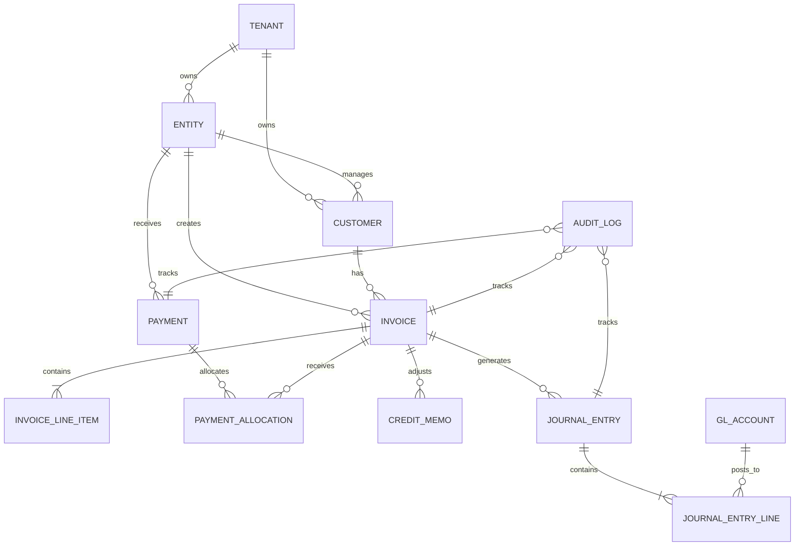

# Multi-Tenant ERP Invoicing & Accounts Receivable Prototype

## Overview

This project implements a prototype **Invoicing and Accounts Receivable (AR) module** for a multi-tenant ERP platform. The objective is to demonstrate enterprise application design, financial domain knowledge, accounting integration, and scalable backend architecture.

The solution is implemented using **Node.js** and **Express.js** and models common ERP workflows such as invoice creation, invoice approval, payment allocation, General Ledger (GL) integration, Accounts Receivable (AR) aging, and audit logging.

The implementation focuses on correctness of accounting workflows rather than UI development and follows common ERP principles such as double-entry bookkeeping, immutable financial postings, tenant isolation, and document lifecycle management.

---

# Technology Stack

* Node.js
* Express.js
* Swagger (OpenAPI)
* Docker Compose
* In-Memory Data Store (Prototype)

Production implementation would replace the in-memory storage with PostgreSQL using ACID transactions and database migrations.

---

# Features

* Multi-tenant architecture
* Multi-entity support
* Invoice lifecycle management
* General Ledger integration
* Automatic journal entry generation
* Payment allocation
* AR Aging
* Audit logging
* Swagger API documentation

---

# API Endpoints

| Method | Endpoint                        | Description              |
| ------ | ------------------------------- | ------------------------ |
| POST   | `/invoices`                     | Create Invoice           |
| GET    | `/invoices/{id}`                | Retrieve Invoice         |
| POST   | `/invoices/{id}/approve`        | Approve Invoice          |
| POST   | `/payments`                     | Record Customer Payment  |
| GET    | `/customers/{id}/aging`         | AR Aging Summary         |
| GET    | `/journal-entries?invoice={id}` | Retrieve Journal Entries |

Interactive API documentation is available at:

```text
http://localhost:3000/api-docs
```

---

# Repository Structure

```text
src/
├── controllers/
├── routes/
├── middleware/
├── services/
├── utils/
├── constants/
├── data/
└── config/
```

---

# Documentation

Detailed design documentation is available under:

* `docs/architecture.md`
* `docs/financial-controls.md`
* `docs/experience-showcase.md`

---

# Running the Project

```bash
npm install
npm run dev
```

Swagger UI:

```text
http://localhost:3000/api-docs
```

---

# AI Tool Usage

The implementation was developed using:

* ChatGPT
* GitHub Copilot

AI assistance was used for:

* API scaffolding
* Documentation drafting
* Financial controls review
* Design validation

All architectural decisions, accounting treatment, and implementation details were reviewed and validated manually.

---

# Time Spent

| Activity                        | Time        |
| ------------------------------- | ----------- |
| Data Model & Architecture       | ~1 hour     |
| API Development                 | ~2 hours    |
| Financial Controls & Compliance | ~30 minutes |
| Documentation                   | ~30 minutes |

Total: **Approximately 4 hours**

