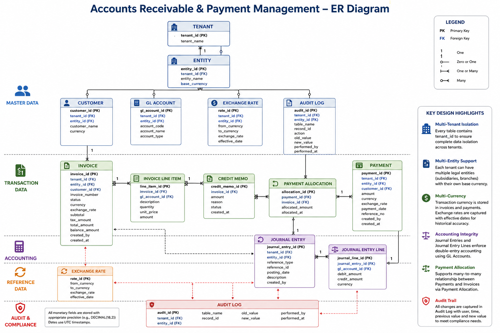

# Data Model and Architecture Design

# 1. System Overview

The solution implements a multi-tenant Accounts Receivable module that supports:

* Invoice Management
* Payment Processing
* General Ledger Integration
* Multi-Currency Transactions
* Audit Logging
* Financial Reporting

The architecture follows a layered design consisting of:

```text
Client
    │
REST API (Express)
    │
Controllers
    │
Business Services
    │
Repositories
    │
Database
```

---

# 2. Entity Relationship Model




---

## Entity Relationship Diagram

<p align="center">
    
</p>

---

# 3. Core Entities

* Tenant
* Entity (Subsidiary)
* Customer
* Invoice
* Invoice Line Item
* Payment
* Payment Allocation
* Credit Memo
* GL Account
* Journal Entry
* Journal Entry Line
* Audit Log

---

# 4. Multi-Tenant Design

Every financial table contains:

* tenant_id
* entity_id

All API requests require:

* x-tenant-id
* x-entity-id
* x-user-id

Tenant resolution middleware ensures complete data isolation.

---

# 5. Multi-Currency Design

Each invoice stores:

* Transaction Currency
* Exchange Rate
* Base Currency

Exchange rates are captured at transaction time and remain immutable for historical accuracy.

---

# 6. Audit Trail

Every transaction records:

* Created By
* Created At
* Updated By
* Updated At

Additionally, an Audit Log captures:

* Table Name
* Record ID
* Previous Value
* New Value
* User
* Timestamp

---

# 7. Accounting Integration

Invoice Approval

```
Dr Accounts Receivable
Cr Revenue
```

Payment Recording

```
Dr Bank
Cr Accounts Receivable
```

Only Approved invoices generate accounting entries.

---

# 8. Partial Payments

Payments may be allocated manually or automatically.

Automatic allocation applies payments to the oldest outstanding invoices first.

Invoice statuses transition:

```
APPROVED
↓
PARTIALLY_PAID
↓
PAID
```

---

# 9. Credit Memo Handling

Approved invoices are immutable.

Corrections are performed using:

* Credit Memo
* Void and Reissue

This preserves auditability.

---

# 10. Invoice Lifecycle

```
DRAFT
   │
Approve
   │
APPROVED
   │
Send
   │
SENT
   │
Payment
   │
PARTIALLY_PAID
   │
Payment
   │
PAID

APPROVED
   │
Void
   │
VOID

PARTIALLY_PAID
   │
Write Off
   │
WRITTEN_OFF
```

---

# 11. Business Rules

| State          | Allowed Operations          |
| -------------- | --------------------------- |
| Draft          | Edit, Delete, Approve       |
| Approved       | Send, Record Payment        |
| Sent           | Record Payment              |
| Partially Paid | Receive Additional Payments |
| Paid           | View Only                   |
| Void           | View Only                   |
| Written Off    | View Only                   |

---

# 12. API Design

Implemented APIs

* POST /invoices
* GET /invoices/{id}
* POST /invoices/{id}/approve
* POST /payments
* GET /customers/{id}/aging
* GET /journal-entries

---

# 13. Idempotency

Payment APIs should support an `Idempotency-Key` header to prevent duplicate payment processing during retries.

---

# 14. Bulk Operations

Future enhancements include:

* Batch Invoice Creation
* Bulk Payment Import
* CSV Import
* Scheduled Invoice Generation

These operations would be processed asynchronously using a message queue to improve scalability.

---

# Design Decisions

This prototype uses an in-memory datastore for simplicity and rapid development. In a production implementation, PostgreSQL with ACID transactions, optimistic locking, immutable journal entries, and repository/service layers would be introduced to provide durability, scalability, and operational resilience.
